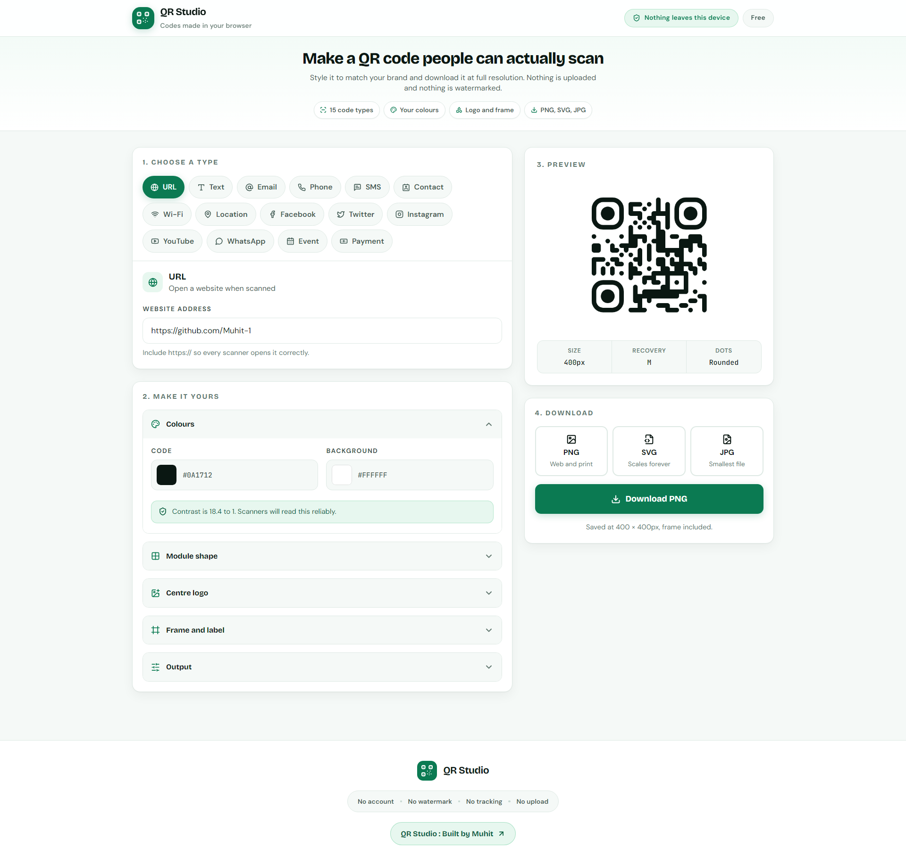

# QR Studio

A QR code generator that runs entirely in the browser. Choose what the code should
do, style it to match your brand, and download it as PNG, SVG or JPG. Nothing is
uploaded to a server and nothing is watermarked.

## Screenshot

<!-- Replace the file below with your own capture: save it to docs/screenshot.png -->



## Features

- 15 code types: URL, text, email, phone, SMS, contact card, Wi-Fi, location,
  Facebook, Twitter, Instagram, YouTube, WhatsApp, calendar event and payment.
- Custom foreground and background colours, with a live contrast check that warns
  when a combination is too faint for cameras to read.
- Six module shapes plus separate styling for the corner rings and corner centres.
- Optional centre logo with adjustable size and clear space.
- Four frame styles with a custom label, included in the downloaded file.
- Export at any size from 200px to 1200px in PNG, SVG or JPG.
- Selectable error correction level from 7% to 30% recovery.

## Requirements

- Node.js 18.17 or newer
- npm

## Getting started

Install dependencies:

```bash
npm install
```

Start the development server:

```bash
npm run dev
```

Open http://localhost:3000 in your browser.

## Scripts

| Command | What it does |
| --- | --- |
| `npm run dev` | Start the development server with hot reload |
| `npm run build` | Produce a static export in `out/` |
| `npm run start` | Serve a production build |
| `npm run lint` | Check the code with ESLint |

## Deployment

`next.config.js` sets `output: 'export'`, so `npm run build` writes a fully static
site to `out/`. Upload that folder to any static host, such as GitHub Pages,
Netlify, Vercel or Cloudflare Pages. No server runtime is required.

## Project structure

```
src/
  app/
    globals.css        Design tokens, base styles and form control styling
    layout.tsx         Document shell and metadata
    page.tsx           Page composition and application state
  components/
    DownloadPanel.tsx  Format buttons and the download action
    Footer.tsx         Site footer
    Header.tsx         Site header
    ModuleArt.tsx      QR module geometry used by the logo and style pickers
    QRCustomizer.tsx   Colour, shape, logo, frame and output controls
    QRInputForm.tsx    Per-type content fields
    QRPreview.tsx      Live preview and code metadata
  constants/
    qrTypes.ts         Code type definitions and default styling
  lib/
    downloadHelper.ts  Frame compositing and file export
    qrBuilder.ts       Turns form values into QR payload strings
  types/
    qr.types.ts        Shared type definitions
```

## Built with

- Next.js 14 with the App Router
- TypeScript
- Tailwind CSS
- qr-code-styling for rendering
- lucide-react for icons

## Privacy

Every code is generated in the browser using client side JavaScript. Form values,
uploaded logos and generated images never leave the device. Note that a QR code
carries its contents in the open, so anyone who scans a Wi-Fi or payment code can
read the values it encodes.

## License

MIT
